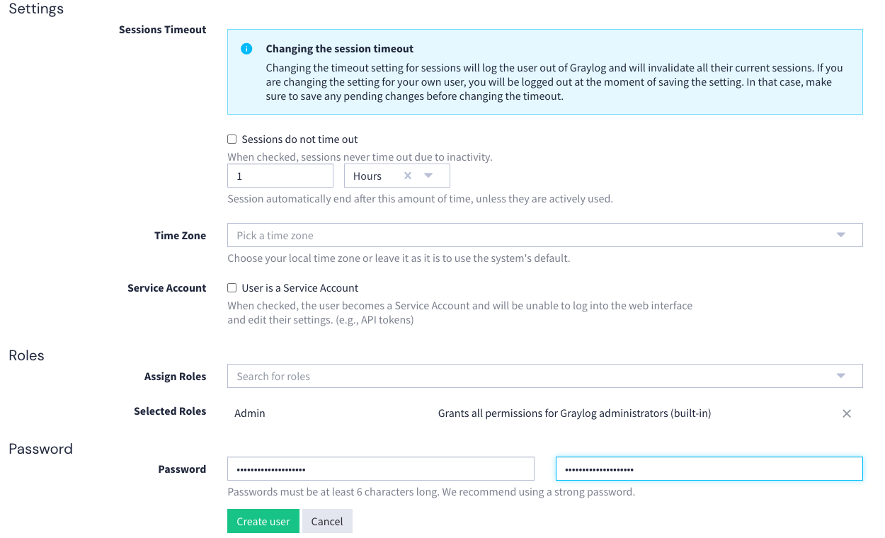
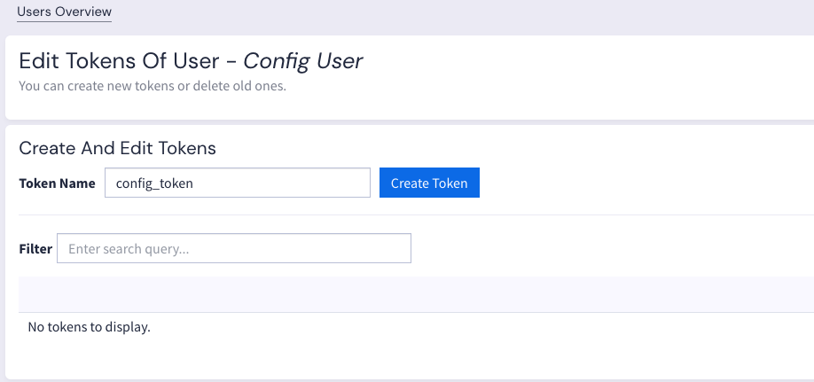

# 📄 Graylog + OpenSearch Log Pipeline Simulation

Ce projet met en place un environnement Docker Compose avec 5 conteneurs pour simuler la collecte, le filtrage et la redirection de logs via **Graylog** et **OpenSearch**.

## 📌 Architecture des conteneurs

1. **Graylog**  
   - Interface Web pour la gestion des logs.  
   - Filtrage des logs via **pipelines** et **rules**.
   - Connexion à OpenSearch pour l’indexation.

2. **OpenSearch**  
   - Moteur de recherche et d’indexation pour stocker les logs.

3. **OpenSearch Dashboards**  
   - Interface Web pour visualiser les données dans OpenSearch.

4. **Log Source Simulator**  
   - Envoi de logs au format **GELF JSON** vers Graylog via API.

5. **Rule Generator Simulator**  
   - Génère dynamiquement des règles de filtrage au format JSON.

6. **Log Destination Simulator** *(optionnel)*  
   - Reçoit les logs filtrés depuis Graylog pour valider la sortie.

---

## 🚀 Lancer l’environnement

```bash
docker-compose up -d
```
---

## 🚀 Créer et configurer l'utilisateur de configuration via l'UI

### Create a config_user in the UI




### Create a token associated to that user (config_token)



### Update the config file in config/graylog/config.cfg
This will be useful for the next step.

## 🚀 Configure Graylog (input, stream, pipeline, ...)

- Launch the script configure.sh

## 🚀 Lancer le script log_sender


## Errors & Solution

##### ElasticSearch readonly
curl -X PUT -H "Content-Type: application/json" \
"http://localhost:9200/graylog_0/_settings" \
-d '{"index.blocks.read_only_allow_delete": null}'

{"acknowledged":true}%                                                                                                                                                                                                                                                
 curl -X PUT -H "Content-Type: application/json" \
"http://localhost:9200/gl-events_0/_settings" \
-d '{"index.blocks.read_only_allow_delete": null}'

{"acknowledged":true}%                                                                                                                                                                                                                                                
curl -X PUT -H "Content-Type: application/json" \
"http://localhost:9200/gl-system-events_0/_settings" \
-d '{"index.blocks.read_only_allow_delete": null}'

{"acknowledged":true}%   